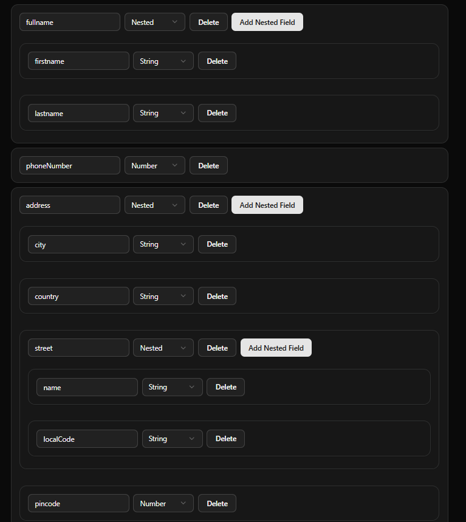
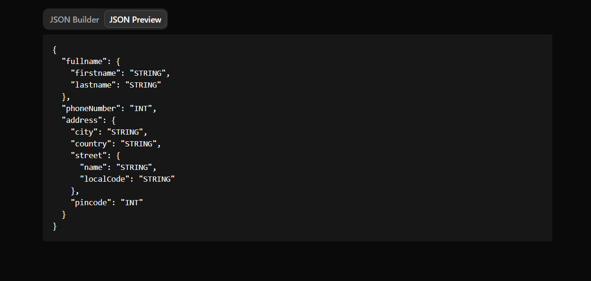

# 🛠️ Dynamic JSON Schema Builder

A fully functional and recursive JSON schema builder built using **Next.js**, **TypeScript**, **Tailwind CSS**, and **ShadCN UI**. It allows users to dynamically create key-value pairs with support for nested objects. Perfect for building or testing JSON structures in real time.

---

## Screenshots of the working project
### JSON BUILDER


### JSON PREVIEW


---

## ✨ Features

- ➕ Add or remove key-value fields
- 🔁 Support for nested (recursive) JSON fields
- 🧠 Real-time JSON preview (auto updates)
- 🧩 Select data types for each field (string, number, nested)
- 💾 Clean, modular, and scalable architecture

---

## 🚀 Tech Stack

- **Next.js** – React Framework for Production
- **TypeScript** – Strongly typed JavaScript
- **Tailwind CSS** – Utility-first CSS framework
- **ShadCN UI** – Beautifully designed accessible UI components

---

## 📝 Usage

- Click on **Add Field** to create a new key-value pair.
- Enter the **Field Name** (e.g., `name`, `email`, `details`, etc.).
- Choose the **Field Type** from the dropdown:
  - `string`
  - `number`
  - `nested` (creates a sub-object with its own key-value pairs)
- For `nested` types:
  - A new nested field section will appear.
  - You can continue adding/removing fields recursively.
- The right side panel displays the **real-time generated JSON**.

---

## 🧪 Getting Started

1. fork the repository
2. clone the repostiory
3. Install the dependencies
```bash
npm isntall
```
4. Run the server
```bash
npm run dev
```

---

